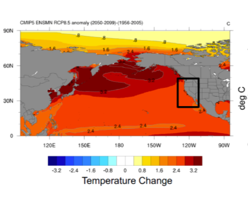
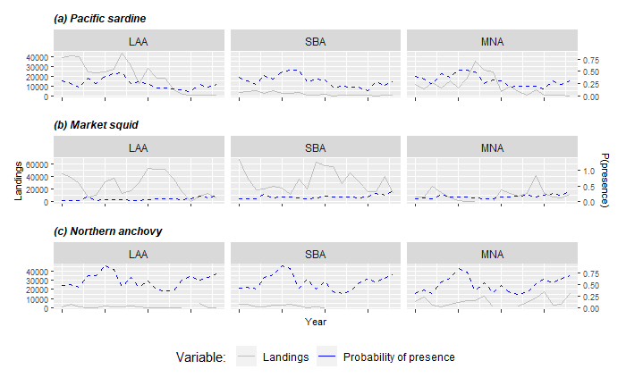
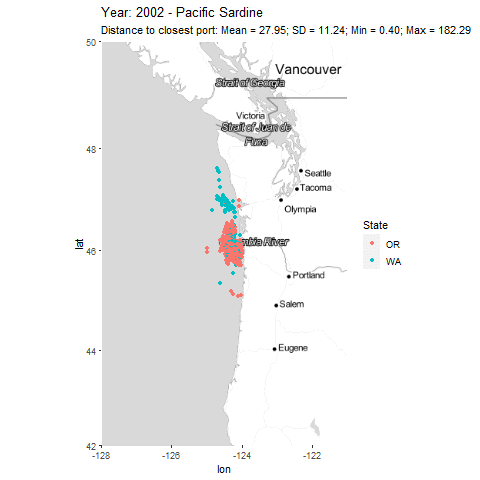
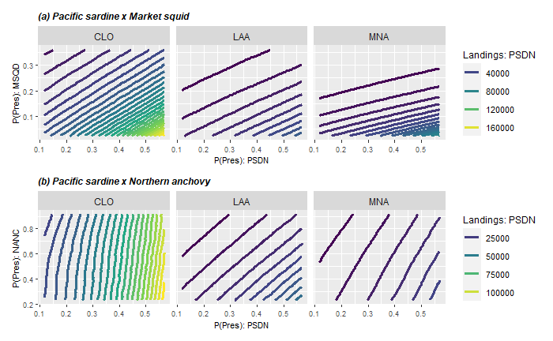
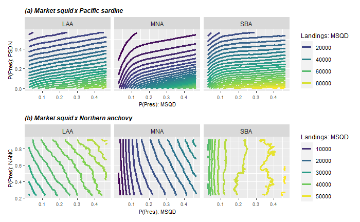
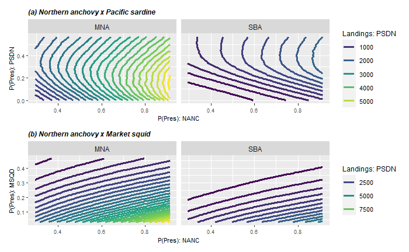
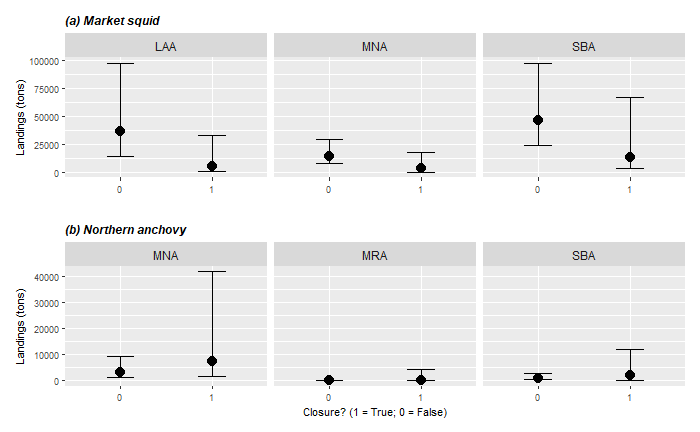

```{r, load_refs, include=FALSE, cache=FALSE}
library(RefManageR)
BibOptions(check.entries = FALSE,
           bib.style = "authoryear",
           cite.style = "alphabetic",
           style = "markdown",
           hyperlink = FALSE,
           dashed = FALSE)
myBib <- ReadBib("C:\\GitHub\\EconAnalysis\\references.bib", check = FALSE)
```

<!-- xaringan:::inf_mr() -->

```{css, echo=FALSE}
# CSS for including pauses in printed PDF output (see bottom of lecture)
@media print {
  .has-continuation {
    display: block !important;
  }
}

.pull-left {
  float: left;
  width: 50%;
}
.pull-right {
  float: right;
  width: 50%;
}
.pull-right ~ p {
  clear: both;
}
```

```{r setup, include=FALSE}
load("C:\\GitHub\\EconAnalysis\\stan_fit.RData")
options(htmltools.dir.version = FALSE)
library(knitr)
opts_chunk$set(
  fig.align="center",  
  fig.height=4, #fig.width=6,
  # out.width="748px", #out.length="520.75px",
  dpi=300, #fig.path='Figs/',
  cache=T#, echo=F, warning=F, message=F
  )
library(bookdown)
library(brms)
library(doBy)
library(dplyr)
library(fontawesome)
library(ggplot2)
library(hrbrthemes)
library(lmtest)
library(lubridate)
library(magrittr)
library(plm)
library(patchwork)
library(reshape)
library(reshape2)
library(scales)
library(sjlabelled)
library(summarytools)
library(texreg)
library(tidyr)
library(tidyverse)
library(tinytex)
library(viridis)
library(xtable)
library(zoo)
library(here) 
```
```{r data_import, include=FALSE}
PacFIN_dat <- read.csv(file = here::here("Data", "PacFin.csv"))

collapse <- PacFIN_dat %>%
  dplyr::filter(Species_code == "PSDN" | Species_code == "MSQD"  | Species_code == "NANC") %>%
  dplyr::select(Landing_year, Port, PSDN_SDM_60, MSQD_SDM_90, NANC_SDM_20, Landings, Species_code) %>% 
  dplyr::filter(Port == "LAA" | Port == "MNA" | Port == "SBA") %>%
      mutate(Port = fct_relevel(Port, "LAA", "SBA", "MNA")) %>% 
  spread(Species_code, Landings) %>% 
  dplyr::rename(Landings_PSDN = PSDN) %>% dplyr::rename(Landings_MSQD = MSQD) %>% dplyr::rename(Landings_NANC = NANC) %>%
  filter(Landing_year >= 2000 & Landing_year <= 2018)
```

```{r general_functions, include=FALSE}

meanfun <- function(x, ...){
  c(mean=mean(x, na.rm=TRUE, ...)) #, v=var(x, na.rm=TRUE, ...), l=length(x))
}

sumfun <- function(x, ...){
  c(sum=sum(x, na.rm=TRUE, ...)) #, v=var(x, na.rm=TRUE, ...), l=length(x))
}

sum_mean_fun <- function(x, ...){
  c(mean=mean(x, na.rm=TRUE, ...), sum=sum(x, na.rm=TRUE, ...)) #, l=length(x))
}

colorize <- function(x, color) {
  if (knitr::is_latex_output()) {
    sprintf("\\textcolor{%s}{%s}", color, x)
  } else if (knitr::is_html_output()) {
    sprintf("<span style='color: %s;'>%s</span>", color,
      x)
  } else x
}


```


# California Current System

.pull-left[

1. Unique ecosystem
  + Provide many ecosystem services,
  + Sustains commercial and recreational fisheries,
  + Protected species,
  + **Forage species (e.g. Coastal Pelagics).**
2. Climate is changing: 
```{r climate, echo=FALSE, out.width = '100%'}

```
]

.pull-right[

```{r sardine_biomass1, echo=FALSE, fig.cap = "3. Changes in species distribution and regulations", out.width = '100%'}
knitr::include_graphics("sardine_biomass.png")
```
]

---
# Research Question

* **Big picture:**
  + How will climate change impact fishing communities?
  
* **Specific question:** 
  + How does changes in species distribution and regulations (i.e. closures) will affect catch composition and  landings in the *Coastal Pelagic Species (CPS)* fishery? 
  
 
---
# Methodology

* **Two approaches:**
  + Landing model (result for the public aggregate data).
  + Participation model (no results yet). 

* **Data:**
  + Fish tickets from The Pacific Fisheries Information Network (PacFIN)
  + Current and projected species distribution ([Muhling et al, 2020](https://doi.org/10.3389/fmars.2020.00589)). 
  + Fishing locations from logbooks (maybe Global Fishing Watch)

---
class: inverse, center, middle
name: landingmodel

# Landing model

<html><div style='float:left'></div><hr color='#fdc700' size=1px width=796px></html>


---

# Landing model


* Hierarchical Bayesian Hurdle model
  + Uncertainty from modeling and observation.  All parameters are random variables 
  + **Multilevel effects (i.e. hierarchical effects by ports/vessel)**.
  + Incorporate previous knowledge as a prior ([Smith et al, 2020](https://onlinelibrary.wiley.com/doi/10.1111/fog.12529)).
  + Hurdle allows to model the zeros.

---

# Landing model

* Separate model for:
  + Pacific sardine, Northern anchovy and Market squid. 
* Ports were chosen using historical landings. 
* Interaction between species 
  + Through the probability of presence (SDMs outputs)

```{r sdm_landings, echo=FALSE, out.width = '65%'}

```

---

  
# Landing model: Bayesian framework.

+ In general, our Bayesian models have the following structure:
$$[\theta_i | q_{i,t}] \varpropto f\left(q_{i,t} | \theta_i\right) \times [\theta_i]$$ 
  + where $q_{i,t}$ is the observed landings of the corresponding species in port $i \in (1,\ldots,L)$ at year $t$, $L$ is the total number of port, and $\theta_i$ are the parameters (i.e. random-coefficients) to be estimated at the port level.

+ The distribution $f\left(q_{it} | \theta_j\right)$ can be rewritten as:
$$f\left(q_{it} | \theta_i \right) = \begin{cases}
p_{it} & \text{if} \quad q_{it} = 0  \\
\left[1-p_{it}\right] \text{gamma} \left(q_{it} | \frac{\mu_{it}^2}{\sigma^2}, \frac{\mu_{it}}{\sigma^2} \right) & \text{if} \quad q_{it} > 0.
\end{cases}$$

  + where $\text{logit}(p_{it}) = \bf{X}\gamma_i$ and $\mu_{it} = \bf{X}\beta_i$. 

---

# Landing model: Bayesian framework.

.pull-left[

+ Specifically $\mu_{it}$ is defined as the following: 

$$\begin{eqnarray} \mu_{it}  = & \beta^0_{i} & + \beta^1_{i} Pr(Prec.PSDN)_{it}  \\ & + & \beta^2_{i} Pr(Prec.MSQD)_{it} \\
& + & \beta^3_{i} Pr(Prec.NANC)_{it}  \end{eqnarray}$$

  
  + where $Pr(Prec)$ is the probability of presence. $\text{logit}(p_{it})$ follows the same structure.

+ Other variables:
  + Annual Catch Limits (ACL)
  + Closure
  + Prices by port
  + Average distances traveled `r colorize("(To be included)", "red")`
  + Fuel cost `r colorize("(To be included)", "red")`

]  
  
.pull-right[



]
  
  

---
class: inverse, center, middle
name: landingmodel

# Participation model

<html><div style='float:left'></div><hr color='#fdc700' size=1px width=796px></html>


---

# Participation model

`r colorize("<< No results yet! >>", "red")`

+ Effect of abundance/closure in seasonal participation. 
+ We model the probability $p_{ijm}$ that vessel $i$ fishes species $j$ in month $m$ as:
$$\begin{align*}
\text{logit}(p_{ijy}) = & \beta_1 + \beta_2  Closure + \beta_3 Mean.revenue_j + \beta_4 ExpectedCatch_j \\
& + \beta_5 HHI_i + \beta_6 Percent.revenue_j + \beta_7 LCG_i + \beta_8 LI_i \\
& + \beta_9 Year.fished. 
\end{align*}$$
+ From [Richerson & Holland (2017)](https://doi.org/10.1093/icesjms/fsx093):
  + HHI = Diversification measurement 
  + Percent.revenue = Dependence on the species in consideration
  + Latitudinal center of gravity (LCG) = Typical landings location 
  + Latitude inertia (LI) = Dispersion around center of gravity

---

class: inverse, center, middle
name: landingmodel

# Results

<html><div style='float:left'></div><hr color='#fdc700' size=1px width=796px></html>


---


# Results: Effect of presence

```{r sdm_on_landings, echo=FALSE, out.width = '75%'}
knitr::include_graphics("by_port_SDM_on_landings.png")

```


---

# Results: Interaction effects on PSDN

```{r int_psdn, echo=FALSE, out.width = '75%'}


```

---

# Results: Interaction effects on MSQD

```{r int_msqd, echo=FALSE, out.width = '75%'}


```

---

# Results: Interaction effects on NANC

```{r int_nanc, echo=FALSE, out.width = '75%'}


```


---

# Results: Pacific sardine closure

```{r closure, echo=FALSE, out.width = '75%'}


```


---

class: inverse, center, middle
name: landingmodel

# Conclusions
<html><div style='float:left'></div><hr color='#fdc700' size=1px width=796px></html>


---

# Conclusions

1. Slightly positive effect on presence on landings.
2. Substitution between market squid and Pacific sardine. 
  + It seems that Pacific sardine is more preferred than market squid.
3. Northern anchovy is less preferred.
  + Exit when sardine abundance is high or low. 
4. Closure reduce market squid landings. Participation decrease?
5. More in details on constraints


---

class: inverse, center, middle
name: future-work

# Future work

<html><div style='float:left'></div><hr color='#fdc700' size=1px width=796px></html>


---

# Future work

+ Incorporate individual data for landings.
  + Vessels landings? or port landings?
  + Vessel/port heriarchal effects. 
+ Estimate participation model.
+ Forecast using SDM projections.
+ Study changes on effort? (number of trips by species)


---------------------------------------------------------

+ Other project:
  + Discrete choice model
      1. Daily information for landings. 
      2. Global Fishing Watch.
      3. Decision *where* and *what* to fish.
      4. Forecast future fleet movements. 
  
---

class: inverse, center, middle


# Thank you for your attention!

`r fa('address-book')` [felipequezada.com](https://felipequezada.com/)

`r fa('envelope')` [felipe.quezada@noaa.gov](mailto:felipe.quezada@noaa.gov)

`r fa('graduation-cap')` Postdoctoral Scholar, UC Santa Cruz & NOAA-SWFSC

```{r gen_pdf, include = FALSE, cache = FALSE, eval = TRUE}
 infile = list.files(pattern = '.html')
 pagedown::chrome_print(input = infile, timeout = 100)
```

